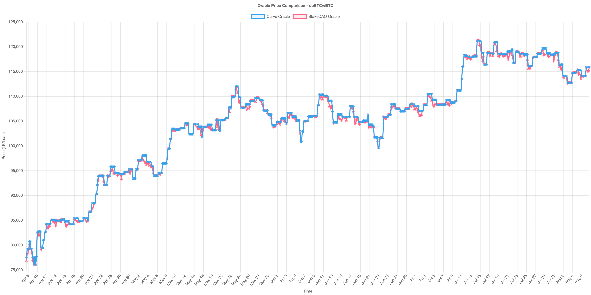
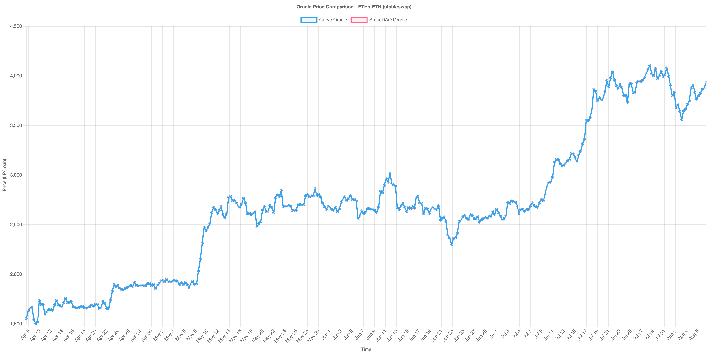
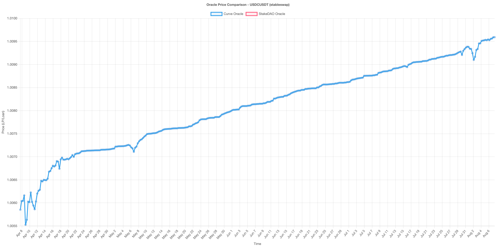
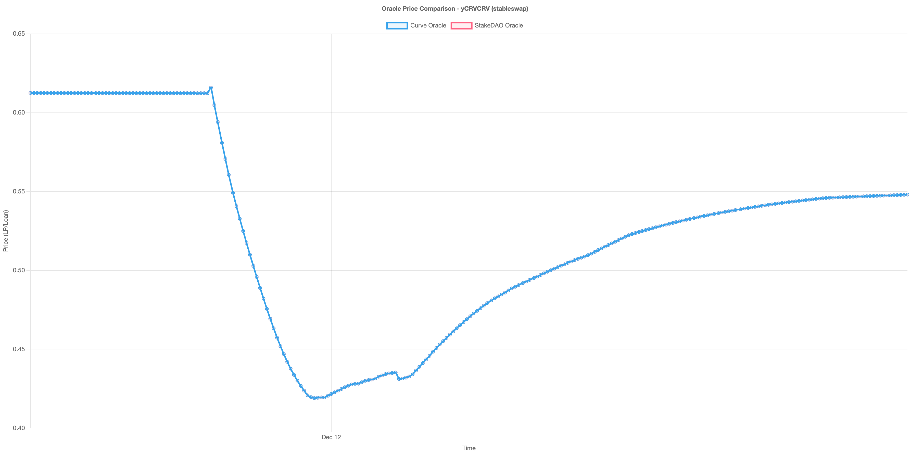
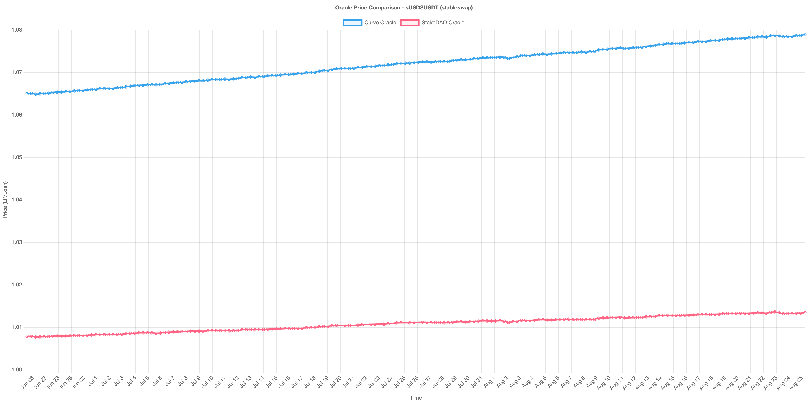
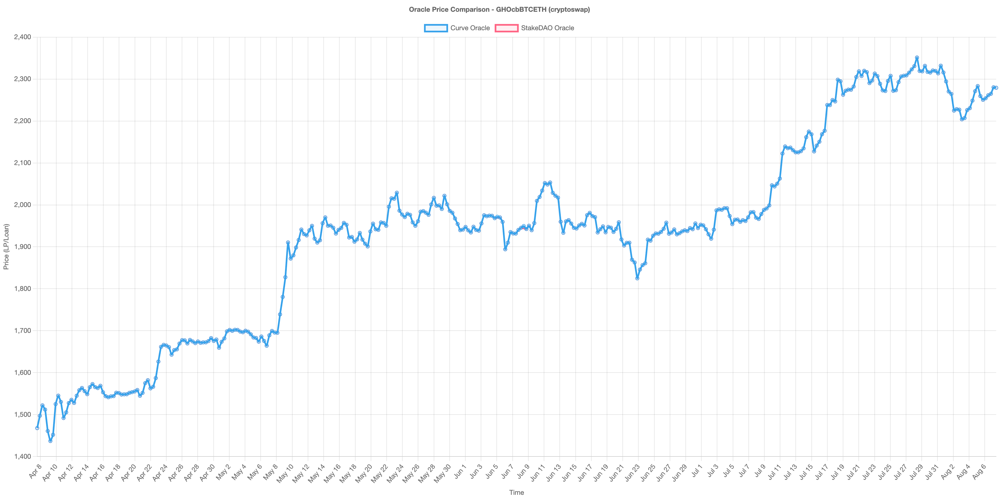
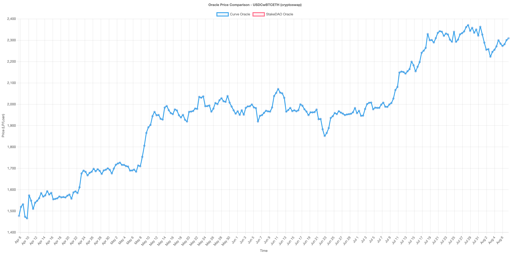
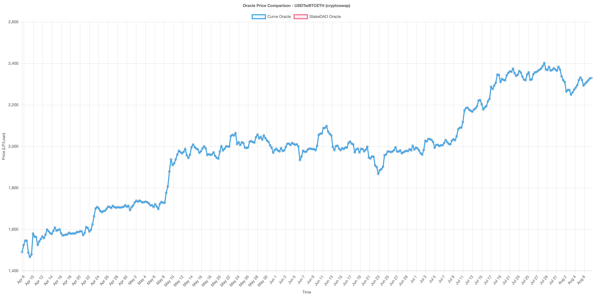

# Curve Oracles Benchmark

Minimalistic benchmark for Curve oracles.

| Metric                        | ETHstETH | USDCUSDT | cbBTCwBTC | sUSDSUSDT | yCRVCRV |
| ----------------------------- | -------- | -------- | --------- | --------- | ------- |
| Total Data Points             | 362      | 364      | 363       | 175       | 257     |
| Correlation                   | 1.0000   | 1.0000   | 1.0000    | 0.9986    | 1.0000  |
| Average Price Difference (%)  | 0.0000   | 0.0000   | 0.0000    | 6.0596    | 0.0000  |
| Max Price Difference (%)      | 0.0000   | 0.0000   | 0.0000    | 6.4584    | 0.0000  |
| Min Price Difference (%)      | 0.0000   | 0.0000   | 0.0000    | 5.6679    | 0.0000  |
| Standard Deviation (Absolute) | 0.0000   | 0.0000   | 0.0000    | 0.0025    | 0.0000  |
| Standard Deviation (%)        | 0.0000   | 0.0000   | 0.0000    | 0.2329    | 0.0000  |
| Tracking Error                | 0.0000   | 0.0000   | 0.0000    | 0.0613    | 0.0000  |
| StakeDAO Volatility (%)       | 418.01%  | 1.02%    | 209.56%   | 1.55%     | 93.69%  |
| Curve Volatility (%)          | 418.01%  | 1.02%    | 209.56%   | 2.02%     | 93.69%  |
| Information Ratio             | 0.0000   | 0.0000   | 0.0000    | 0.9992    | 0.0000  |
| Max Drawdown (%)              | 23.79%   | 0.06%    | 11.06%    | 0.04%     | 31.97%  |
| Median Absolute Deviation     | 0.0000   | 0.0000   | 0.0000    | 0.0022    | 0.0000  |
| StakeDAO Higher (%)           | 0.00%    | 0.00%    | 0.00%     | 0.00%     | 0.00%   |
| StakeDAO Lower (%)            | 0.00%    | 0.00%    | 0.00%     | 100.00%   | 0.00%   |
| Prices Equal (%)              | 100.00%  | 100.00%  | 100.00%   | 0.00%     | 100.00% |

## Interpretation Guide

- **Correlation**: 1.0 = perfect correlation, 0.0 = no correlation
- **Price Differences**: Lower is better (closer to Curve's oracle)
- **Tracking Error**: Lower is better (more consistent with Curve)
- **Volatility**: Lower is better (more stable pricing)
- **Information Ratio**: Positive = StakeDAO outperforms, Negative = Curve outperforms
- **Relative Performance**: 50/50 split = no bias, higher % = systematic bias

## Performance Summary

- **Best Correlation**: yCRVCRV (100.000%)
- **Lowest Tracking Error**: yCRVCRV (0.000000)
- **Most Balanced**: yCRVCRV (0.00% difference)

### Data

#### cbBTC/wBTC

The data are [here](./data/stableswap/cbBTCwBTC) and the CSV files are [here](./assets/csv).

#### ETH/stETH

The data are [here](./data/stableswap/ETHstETH) and the CSV files are [here](./assets/csv).

#### USDC/USDT

The data are [here](./data/stableswap/USDCUSDT) and the CSV files are [here](./assets/csv).

#### yCRV/CRV

The data are [here](./data/stableswap/yCRVCRV) and the CSV files are [here](./assets/csv).
This benchmark is focused on the yCRV/CRV pool depeg event that happened in December 2023.

#### sUSDS/USDT

The data are [here](./data/stableswap/sUSDSUSDT) and the CSV files are [here](./assets/csv).

> [!WARNING]
> The price difference between both oracles is explained by the fact that Curve's oracle is pricing the underlying token instead of the appreciating token while pricing coins0.
> This results in a higher price for the LP token. This is a known issue that is covered by our implementation.

## Cryptoswap Oracles

| Metric                        | GHOcbBTCETH | USDCwBTCETH | USDTwBTCETH |
| ----------------------------- | ----------- | ----------- | ----------- |
| Total Data Points             | 362         | 364         | 363         |
| Correlation                   | 1.0000      | 1.0000      | 1.0000      |
| Average Price Difference (%)  | 0.0000      | 0.0000      | 0.0000      |
| Max Price Difference (%)      | 0.0000      | 0.0000      | 0.0000      |
| Min Price Difference (%)      | 0.0000      | 0.0000      | 0.0000      |
| Standard Deviation (Absolute) | 0.0000      | 0.0000      | 0.0000      |
| Standard Deviation (%)        | 0.0000      | 0.0000      | 0.0000      |
| Tracking Error                | 0.0000      | 0.0000      | 0.0000      |
| StakeDAO Volatility (%)       | 182.48%     | 189.98%     | 187.77%     |
| Curve Volatility (%)          | 182.48%     | 189.98%     | 187.77%     |
| Information Ratio             | 0.0000      | 0.0000      | 0.0000      |
| Max Drawdown (%)              | 11.13%      | 11.34%      | 11.02%      |
| Median Absolute Deviation     | 0.0000      | 0.0000      | 0.0000      |
| StakeDAO Higher (%)           | 0.00%       | 0.00%       | 0.00%       |
| StakeDAO Lower (%)            | 0.00%       | 0.00%       | 0.00%       |
| Prices Equal (%)              | 100.00%     | 100.00%     | 100.00%     |

## Interpretation Guide

- **Correlation**: 1.0 = perfect correlation, 0.0 = no correlation
- **Price Differences**: Lower is better (closer to Curve's oracle)
- **Tracking Error**: Lower is better (more consistent with Curve)
- **Volatility**: Lower is better (more stable pricing)
- **Information Ratio**: Positive = StakeDAO outperforms, Negative = Curve outperforms
- **Relative Performance**: 50/50 split = no bias, higher % = systematic bias

## Performance Summary

- **Best Correlation**: USDTwBTCETH (100.000%)
- **Lowest Tracking Error**: USDTwBTCETH (0.000000)
- **Most Balanced**: USDTwBTCETH (0.00% difference)

### Data

#### GHO/cbBTC/ETH

The data are [here](./data/cryptoswap/GHOcbBTCETH) and the CSV files are [here](./assets/csv).

#### USDC/wBTC/ETH

The data are [here](./data/cryptoswap/USDCwBTCETH) and the CSV files are [here](./assets/csv).

#### USDT/wBTC/ETH

The data are [here](./data/cryptoswap/USDTwBTCETH) and the CSV files are [here](./assets/csv).

## Oracle Comparison Summary - All Pools

| Metric                  | cryptoswap-GHOcbBTCETH | cryptoswap-USDCwBTCETH | cryptoswap-USDTwBTCETH | stableswap-ETHstETH | stableswap-USDCUSDT | stableswap-cbBTCwBTC | stableswap-sUSDSUSDT | stableswap-yCRVCRV |
| ----------------------- | ---------------------- | ---------------------- | ---------------------- | ------------------- | ------------------- | -------------------- | -------------------- | ------------------ |
| Correlation             | 1.0000                 | 1.0000                 | 1.0000                 | 1.0000              | 1.0000              | 1.0000               | 0.9986               | 1.0000             |
| Avg Price Diff (%)      | 0.0000                 | 0.0000                 | 0.0000                 | 0.0000              | 0.0000              | 0.0000               | 6.0596               | 0.0000             |
| Tracking Error          | 0.0000                 | 0.0000                 | 0.0000                 | 0.0000              | 0.0000              | 0.0000               | 0.0613               | 0.0000             |
| StakeDAO Volatility (%) | 182.48%                | 189.98%                | 187.77%                | 418.01%             | 1.02%               | 209.56%              | 1.55%                | 93.69%             |
| StakeDAO Higher (%)     | 0.00%                  | 0.00%                  | 0.00%                  | 0.00%               | 0.00%               | 0.00%                | 0.00%                | 0.00%              |
